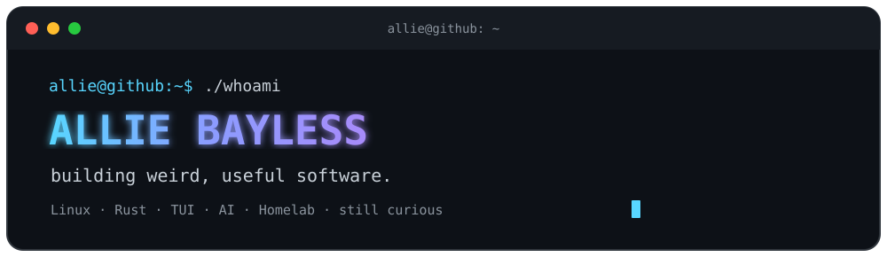

<div align="center">



<br>


</div>

---

## `> whoami`

```text
allie@github:~$ whoami

Allie Bayless
Software designer · developer · lifelong tinkerer
```

Part of the **original SimCity development team in the late ’80s**.

After a long career in software, I'm back building things again —
**Linux tools, Rust apps, TUIs, AI experiments, and weird little ideas that probably shouldn't exist but do.**

I've been around software long enough to remember when a small team could build something strange, ship it, and accidentally help define a genre.

I'm still chasing that feeling.

---

## `> currently-building`

I like software that feels **fast, focused, useful, and a little different**.

<table>
<tr>
<td width="33%" align="center">

### 🖥️ TUI

Terminal-first interfaces

Fast. Keyboard driven.
No unnecessary chrome.

</td>
<td width="33%" align="center">

### 🦀 Rust

Native applications

Small binaries.
Fast tools. Weird ideas.

</td>
<td width="33%" align="center">

### 🤖 AI

Local models & agents

LLMs, coding agents,
experiments and automation.

</td>
</tr>

<tr>
<td width="33%" align="center">

### 🐧 Linux

Desktop & system tools

Wayland, Hyprland,
and things the OS forgot.

</td>
<td width="33%" align="center">

### 🧰 Homelab

Self-hosted everything

Docker, Proxmox,
services and infrastructure.

</td>
<td width="33%" align="center">

### 💡 Experiments

`what if we...`

Usually where
the fun starts.

</td>
</tr>
</table>

---

## `> projects`

### Things currently escaping the lab

|     | Project                                             |                                  |
| :-: | --------------------------------------------------- | -------------------------------- |
|  📝 | **[tide](https://github.com/allisonhere/tide)**   | Notes, ideas and experiments     |
|  ⚡  | **[tidemail](https://github.com/allisonhere/tidemail)** | Terminal-focused software        |
|  🧪 | **[tideftp](https://github.com/allisonhere/tideftp)**   | Software experiments and tooling |
| 🛠️ | **[assho)](https://github.com/allisonhere/assho)**   |      se :P Worth a look           |

```text
STATUS

[████████████████████░░░░] building
```

> There are usually more projects in progress than finished.

**That's part of the fun.**

---


## `> stack`

```text
┌──────────────────────────────────────────────┐
│                                              │
│  OS          Linux                           │
│  Language    Rust                            │
│  UI          Terminal / TUI / Native         │
│  Infra       Docker / Proxmox / Homelab      │
│  AI          Local LLMs / Agents             │
│  Philosophy  Build the interesting thing.    │
│                                              │
└──────────────────────────────────────────────┘
```

---

## `> currently-experimenting-with`

```text
$ ls ~/ideas

terminal-first-apps/
rust-native-tools/
local-ai/
coding-agents/
linux-desktop/
self-hosted-everything/
probably-a-bad-idea/
```

Most of my projects start with:

```text
"I wonder if..."
```

---

<div align="center">

### `> still building_`

**The best part of software was never the software.**
**It was making something that didn't exist yesterday.**

<br>

`─────────────────────────────── ◈ ───────────────────────────────`

<sub>old enough to remember when software came in boxes · curious enough to keep building it</sub>

</div>
